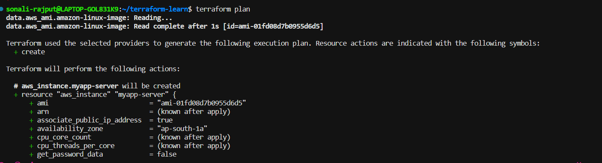
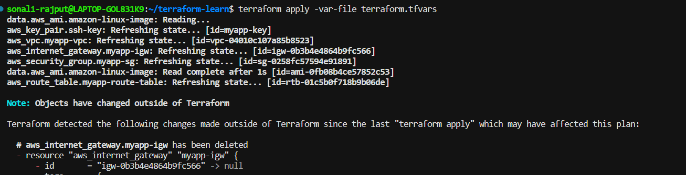
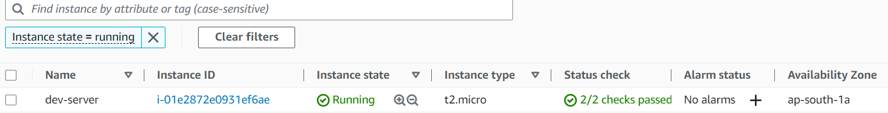
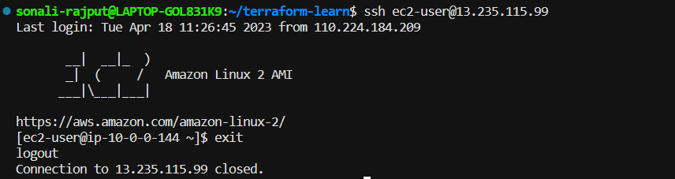
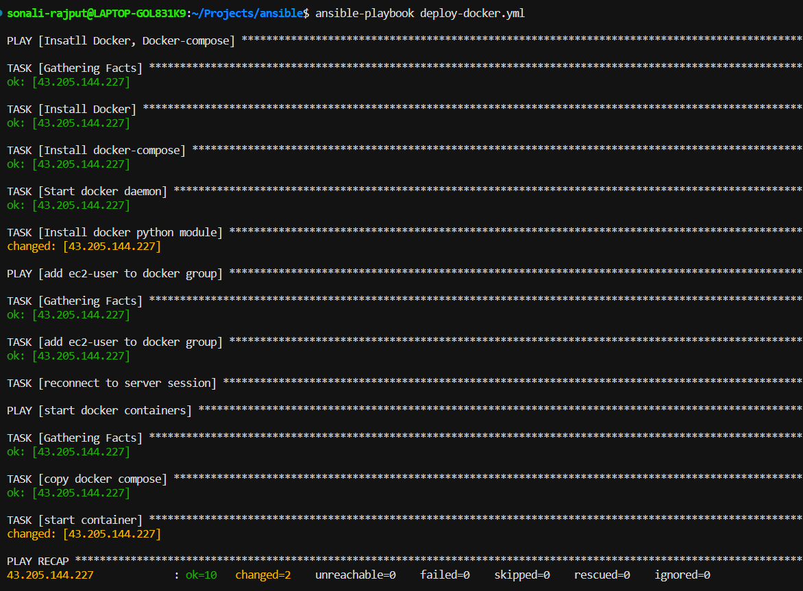
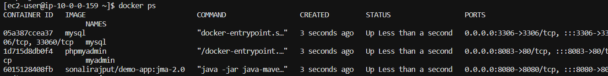
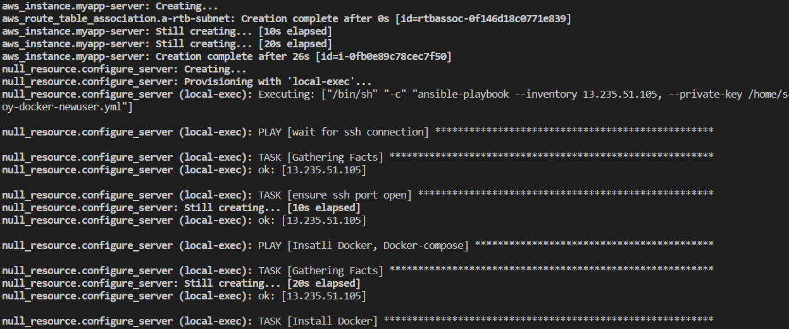

# Docker-Terraform-Ansible Deployment Project

This project aims to automate the deployment of a Docker application using Terraform and Ansible.

## Overview

The project is divided into three main parts:

- **Part 1: Ansible & Docker** - This part focuses on setting up the infrastructure for the project by installing the necessary tools like Docker, Docker & Docker Compose python module and Docker Compose. It also configures the Docker daemon and adds the `ec2-user`/`new-user` to the `docker` group.

- **Part 2: Ansible Integration in Terraform** - This part expands on the previous part by integrating Ansible with Terraform. It allows Terraform to execute Ansible Playbooks to configure the infrastructure before deployment.

- **Part 3: Automating Docker and Terraform Deployment with Ansible** - This part combines the previous parts to fully automate the deployment of a Docker application using Terraform and Ansible.

## Prerequisites

- AWS account with IAM credentials
- AWS CLI
- Terraform
- Ansible
- Docker

## Setup

1. Clone this repository to your local machine:
```
git clone https://github.com/sonali-rajput/automating-docker-and-terraform-deployment-with-ansible.git
```

2. Create an EC2 instance using Terraform:

```
cd automating-docker-and-terraform-deployment-with-ansible/terraform-learn
terraform init
terraform apply
```

### If you want to run/check the ansible playbook manually

```
cd ../ansible
```

3. Adjust the `hosts` inventory file with your EC2 instance IP address.
### To create your own hosts file
create the file as "hosts" and add
```
[docker_server]
<your_server_ip> ansible_ssh_private_key_file=~/.ssh/id_rsa ansible_user=ec2-user
```
4. Run the Ansible playbook:

```
ansible-playbook deploy-docker-newuser.yml
```

## Screenshots and Output
### Terraform Plan

<br>
<br>
### Terraform Apply

<br>
<br>

### ec2 instance

<br>
<br>

### ssh connection

<br>
<br>

### Ansible Playbook

<br>
<br>

### Check Containers

<br>
<br>

### Ansible in Tf

<br>
<br>

### Running app


## Contributing

Pull requests are welcome. For major changes, please open an issue first to discuss what you would like to change.

## License

[MIT](https://choosealicense.com/licenses/mit/)

